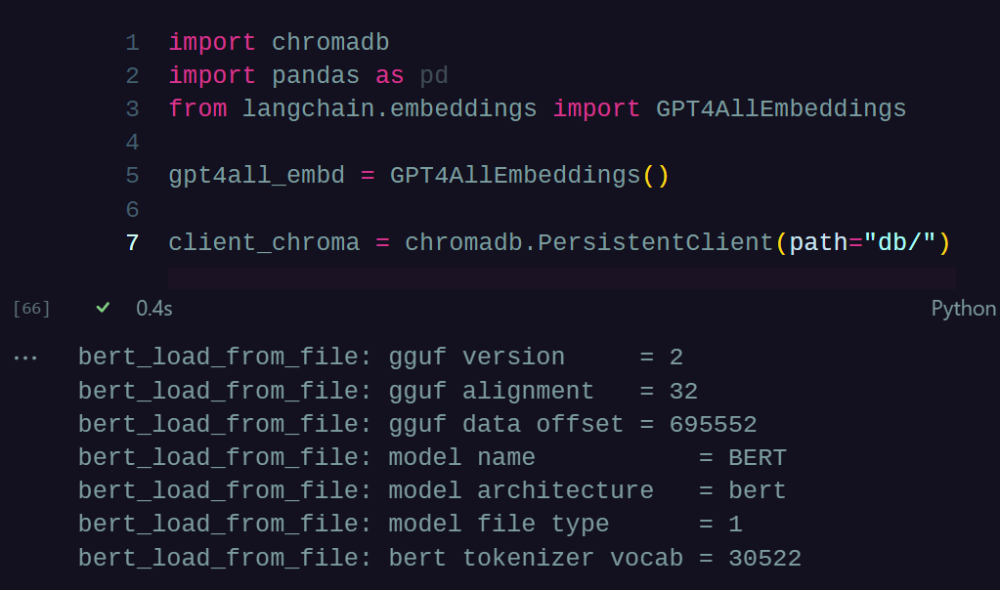
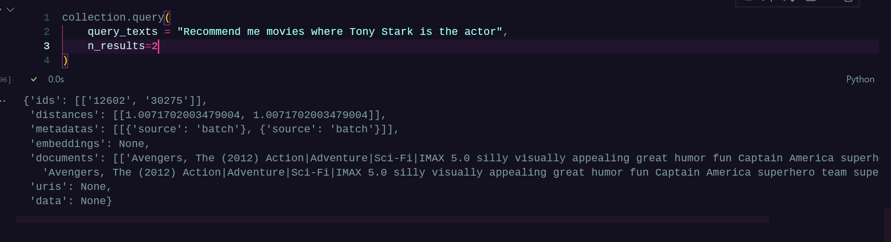

# Lab IA Basics Documentation

This project is a combination of a Next.js frontend application and Python scripts that interact with a ChromaDB database. The main objective is to use ChromaDB to perform queries and provide movie recommendations to the user.

## Results: 

> Documentations is as follows: 

+ Special thanks to: 
    + Github Copilot for helping me write this documentation 🤖
    + Julisa-344 for the styling 🌙

---

## Python Scripts

The Python scripts are responsible for interacting with the ChromaDB database and performing various operations.

`scripts/PsycoClient.py`

This script is responsible for connecting to the Postgres database. It provides functionality to create tables and insert CSV data into these tables. It also provides a method to query data from the tables.

`scripts/ChromaInserter.py`

This script is responsible for inserting data into the ChromaDB database. It uses the GPT4AllEmbeddings class to generate embeddings for the data and then inserts these embeddings into the ChromaDB database.

The **`ChromaInserter`** class has the following methods:
-  __init__: Initializes the ChromaInserter instance, sets up the GPT4AllEmbeddings instance, and connects to the ChromaDB database.

- insert_final_data: Takes a list of data, generates embeddings for each data item, and inserts these embeddings into the ChromaDB database.

---

## Front-Chroma (Next.js Application)

The frontend of the application is built using Next.js. It provides a user interface for interacting with the movie recommendation system.

### Installation

To install the Next.js application, follow these steps:

1. Navigate to the [front-chroma directory](./front-chroma).

2. Run `npm install` to install the necessary dependencies.

3. Run `npm run dev` to start the development server.

### Key Components

- `MovieList.js`: This component displays a list of movies. It takes a movies prop which is an array of movie objects.

- `InputField.js`: This component is a controlled input field that updates its value based on the value prop and calls the onChange prop when the input value changes.

- `page.js`: This is the main page of the application. It manages the state of the input field and the list of movies. It also handles the logic for fetching movies based on the input value.

## Conclusion
This project demonstrates how to use ChromaDB in combination with a Next.js frontend to build a movie recommendation system. The Python scripts handle the interaction with the ChromaDB database, while the Next.js application provides a user interface for interacting with the system.

